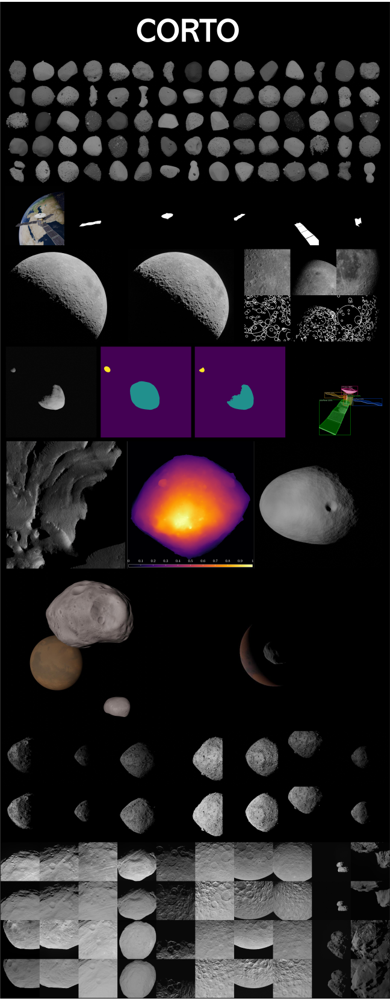
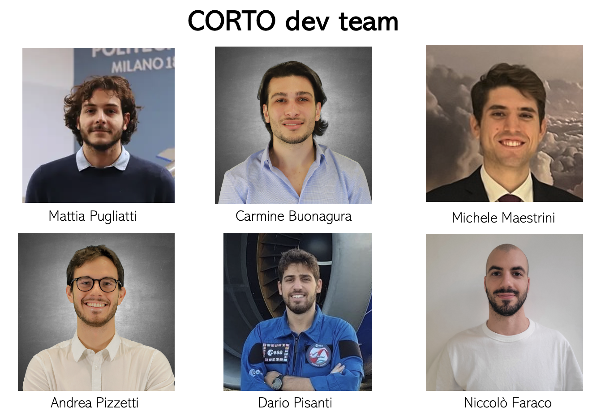

# corto v.1.1
The Celestial Object Rendering TOol (CORTO) is a library that can be used to generate synthetic images-label pairs of celestial and artificial bodies.

At the current stage, the tool is made available with some toy-problem or tutorials for rendering image-label pairs of Eros, Itokawa, Bennu, Didymos, and The Moon. The scenarios are set with the possibility to generate both images and labels. In the current version, corto uses Blender 4.0 and Python 3.11.7



# Setup
To install the library you have two options: 

1) git clone https://github.com/MattiaPugliatti/corto.git
2) pip install cortopy

Then you can install a virtual environment in VSC with the modules listed in the requirements.txt

If you have problems installing the bpy library into VSC, contact the authors. 

To run a tutorial, you need to populate the input folder with one of the scenarios from:

https://drive.google.com/drive/folders/1K3e5MyQin6T9d_EXLG_gFywJt3I18r6H?usp=sharing

Download the scenario of interest, and then locate it into the input folder. Then run the corresponding script within the "tutorials" folder. For example, if you want to generate some image-label pairs of Didymos, after cloning/pip-installing the repository and downloading the folder, your directory should look like this: 

- cortopy
	- __init__.py
	- _Body.py
	- ...
- input 
	- S05_Didymos_Milani (from GDrive)
- monet
	- input
	- output
	- main_MONET.py
- scripts 
- tutorials
	- ...
	- S06_Didymos_Milani.py
- .gitignore
- LICENSE
- requirements.txt
- README.md (from GitHub)

## Experimental Installation Fix (Not Recommended)

For certain combinations of OS and hardware (e.g., macOS 14.3 on first-generation Apple Silicon), the standard installation of `bpy` may fail due to missing distributions on PyPI. **This is only a workaround and is not the recommended approach. Your mileage may vary.**

To proceed with this workaround, first ensure the following compatibility requirements are met for the `bpy` release:

1. **Python Version** - Confirm compatibility with your Python version.
2. **Operating System** - Verify that your OS is supported.
3. **Architecture** - Check that your system’s architecture matches the package requirements.

These details can be confirmed by running the command below in the terminal with the correct Python version and checking compatibility tags:

```bash
python -m pip debug --verbose
```

If compatibility checks pass but `pip install bpy` still returns an error (e.g., `ERROR: No matching distribution found for bpy`), you may try the following steps:

1. Download the latest compatible `<version>.whl` distribution of `bpy` from PyPI.
2. Rename the downloaded `.whl` file to match one of the compatible tags shown in the compatibility check (e.g., `<compatible>.whl`).
3. Install the renamed `.whl` file by running:

   ```bash
   pip install <compatible>.whl
   ```
This should allow the installation to complete if all compatibility requirements are satisfied. 

# Folders descriptions
(cortopy) all classes of the corto library are included in this folder

(docs) all documentation associated with the corto library 

(input) input folder, here is were you need to position all necessary input to run a scenario

(monet) this folder contains the monet tool. Refer to the specific readme within this folder to run monet and generate proceedural asteroid models

(output) this is the output folder in which the image-label pairs are going to be saved. It's going to be populated once you ran a script or a tutorial

(scripts) all sorts of useful scripts are grouped here

(test) test folder for CI/CD

(tutorials) folder containing several tutorials. They are meant to showcase high-level functionalities and the user should use them for imitation learning.

# Tutorial summary 

- basics_Generated_Cloud_input.py : it can be used to showcase the generation of a geometry input in the form of a point cloud

- basics_GeneratedPA_input.py : it can be used to showcase the generation of a geometry input of a camera at a fixed distance and varying phase angles. It's useful to generate input for the calibration tutorial

- basics_Visualize_DepthMap.py : it can be used to visualize the depthmap generated from another tutorial

- S00_Calibration.py : it generates images of a sphere seen from a camera at a fixed distance with varying phase angles. You can modify the specific scattering law to use in the OSL shader.

- S01a_Eros.py : it's the high-fidelity, slower version that you can use to generate image-label pairs of the asteroid Eros. It uses CYCLES.

-S01b_Eros.py : it's the lower-fidelity, faster verion that you can use to generate images of the asteroid Eros. It uses EEVEE.

-S02_Itokawa.py : it generates image-label pairs for the Itokawa scenario. 

-S03_Apophis.py : it generates image-label pairs for the Apophis scenario using OSL shaders.

-S04_Bennu.py: it generates image-label pairs for the Bennu scenario. 

-S05a_Didymos_Milani.py: it generates image-label pairs for the Didymos scenario. It has been used for the training of the image processing of Milani (it uses older shape models).

-S05b_Didymos.py : it generate image-label pairs for the Didymos scenario.

-S06a_Moon.py : it generates image-label pairs of the Moon in a full-disk scenario. Useful for far and medium navigation regimes (approach, far orbits). 

-S06b_Moon.py : it generates image-label pairs of a tile of the Lunar surface. Useful for close navigation regimes (low orbits, landings).

-S07_Mars_Phobos_Deimos.py : it generates image-label pairs for the Mars, Phobos, Deimos multi-body scenario. 

-S08_Earth.py : it generates image-label pairs with Earth as a target body. 

-S09_Frankenstein_Asteroids : it generate image-label pairs for a variety of asteroids with procedurally generated artificial textures. 

-S10_Spacecraft.py : it generates image-label pairs about artificial spacecraft. 


The characteristics for the Scenarios from S00 to S10 are summarized in the following table

| Name of the Scenario | Target Body | Shader Used | Texture Map Used | Labels | Note |
|----------------------|-------------|-------------|------------------|--------|------|
| S00_Calibration.py | Sphere | OSL| NO | TODO | Generates images of a sphere with varying phase angles. Scattering law can be modified in the OSL shader. |
| S01a_Eros.py | Eros | branch & albedo mix | YES | Depth, Mask, Mask w. Shadows, Slopes | High-fidelity, slower version (CYCLES)|
| S01b_Eros.py | Eros | branch & albedo mix  | YES | NO | Lower-fidelity, faster version (EEVEE) |
| S02_Itokawa.py | Itokawa | branch & albedo mix | YES | Depth, Mask, Mask w. Shadows | - |
| S03_Apophis.py | Apophis | OSL | NO | NO | Scattering law can be modified in the OSL shader. |
| S04_Bennu.py | Bennu | branch & albedo mix | YES | Depth, Mask, Mask w. Shadows, Slopes | - |
| S05a_Didymos_Milani.py | Didymos | load material nodetree | NO | Depth, Mask, Mask w. Shadows, Slopes | Uses older shape models. The scenario is the same one used to develop Milani's IP & GNC |
| S05b_Didymos.py | Didymos | load material nodetree | NO | Depth, Mask, Mask w. Shadows, Slopes | Uses updated shape models.|
| S06a_Moon.py | Moon | branch & albedo & displacement mix | YES | Depth, Slopes | Useful for Full-disk lunar rendering.|
| S06b_Moon.py | Moon Surface Tile | lunar | YES | Depth, YOLOv1 (craters), YOLOv2 (craters) | Useful for close-range navigation. Developed by Omar Elzeiny. |
| S07_Mars_Phobos_Deimos.py | Mars, Phobos, and Deimos | create_branch_albedo_mix (x3) | YES | Depth, Slopes, Mask, Mask w. Shadows | Example of a multi-body architecture. |
| S08_Earth.py | Earth | Earth, Atmosphere, Clouds | YES | NO | Example of a multi-body architecture for a celestial body with an atmosphere. |
| S09_Frankenstein_Asteroids.py | Multiple Asteroids | Randomized texture PBSDF | NO | Mask, Mask w. Shadows | Showcases domain randomization via procedully generated asteroid textures. |
| S10_Spacecraft.py | Dawn | None (loaded from object) | YES | NO | - |

# How to run a tutorial script (Visual Studio Code reccomended)

1) Install the repository 

2) Install the bpy module in VSC

3) Install the other libraries listed in the requirements.txt into a virtual environment

4) Download the input data for a specific tutorial from https://drive.google.com/drive/folders/1K3e5MyQin6T9d_EXLG_gFywJt3I18r6H?usp=sharing (For example, download the folder S05_Didymos)

5) Run the script from the "tutorial" folder (For example, the S05_Didymos.py)

6) You should see images and labels generated in an output folder

# How to run your own script 
To shape your own scenario, you can imitate the ones provided in the tutorials. In case you are happy with one of the scenarios, you can always change the inputs and or the tutorial script. Otherwise, if you want to use this library for a different target, you can also imitate how the tutorials script build on it.


# Changelog

| Version | Changelog |
| ------ | ------ |
|    v1.1    |Added Lambert and Oren-Nayar; Added multi-body capability; Added scenario script for Mars-Phobos-Deimos; Fix bugs|

# Dev team 

The current CORTO development team 




