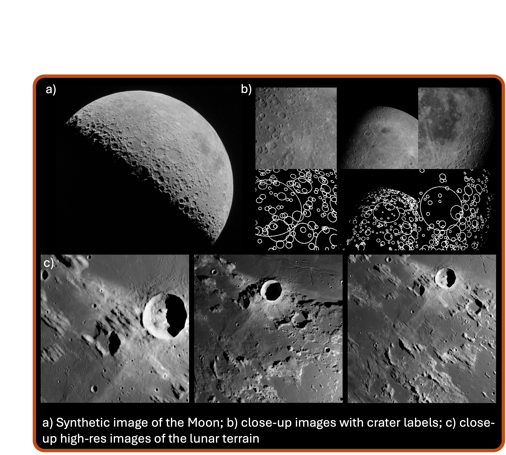
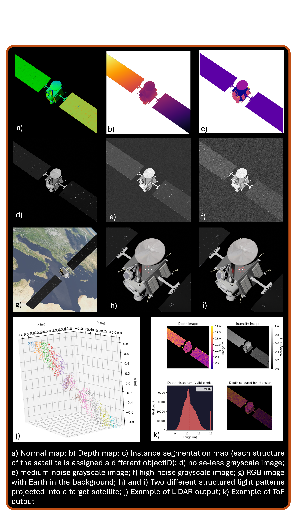
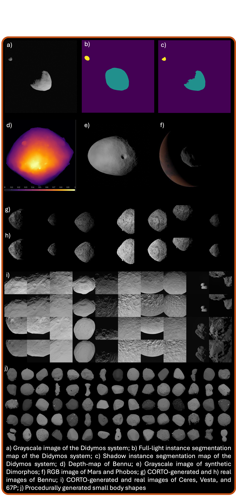

# CORTO v.2.0
The Celestial Object Rendering TOol (CORTO) is a Python library that can be used to generate synthetic image-label pairs of celestial and artificial bodies.

CORTO's functionalities are largely based on the Blender bpy library and extended to facilitate the image generation of space-based bodies. The tool has been developed as an open-source, collaborative project and is continuously improved and expanded in scope by researchers across different institutions around the world. 

Currently, the _cortopy_ library uses bpy 4.2.0 and Python 3.11.7. Optionally, Blender (4.0+) can be used as a GUI to visualize .blend files generated by CORTO. 

<!-- TABLE OF CONTENTS -->
<details>
  <summary>Table of Contents</summary>
  <ol>
    <li>
      <a href="#use-cases">Use cases</a>
    </li>
    <li>
      <a href="#installation">Installation</a>
      <ul>
        <li><a href="#standard-installation">Standard installation</a></li>
        <li><a href="#experimental-installation">Experimental installation</a></li>
      </ul>
    </li>
    <li><a href="#directories-descriptions">Directories descriptions</a></li>
  </ol>
</details>

# Use cases

CORTO can be used in a variety of lunar application from  far, medium, and close navigation regimes. For example, you can use CORTO to generate high-fidelity images with lunar craters and their labels, which you can use to develop crater detection and navigation pipelines. 

<p align="center">

</p>

CORTO can also be used to render artificial satellites. You can use CORTO to get normal and depth maps of the target satellites or you can use it to get istance segmentation labels to train image processing algorithms that are capable to distinguish an antenna from a solar panel. You can play with different noise settings, and you can generate images of satelittes with Earth in the background as a disturbance. Lastly, you can generate grayscale and RGB images as well as LiDAR, Structured light, and ToF sensor's output.

<p align="center">

</p>

Lastly, CORTO has been originally developed to generate image-label pairs for the Didymos system to develop, validate, and test the image processing of the Milani mission: at its hearth, CORTO was born to provide flexibility in generating image-label pair datasets for a variety of tasks focused on small bodies. These functionalities still exists and over the year they have been extended. CORTO can be used to generate instance segmentation masks for multi-body systems, it can be used to generate depth and normal maps, to generate synthetic images of procedurally generated shapes (in conjunction with monet), images of mixed planetary-moon systems (e.g. Mars-Phobos-Deimos), as well as images with BRDF functions that model different material properties.

<p align="center">

</p>

Currently, material properties can be simulated by standalone or mixed shading trees comprising: 
- _diffuseBSDF_
- _principledBSDF_
and ad hoc OSL-based shader implementations functions of:
- _Lambertian_
- _McEwen_
- _LommelSeeliger_
- _SimplifiedHapke_
- _Hapke_
- _Akimov_
- _Minnaert_

CORTO can be easily set up to use **simplified renderings** (viewport and eevee) or **path-tracing** and **ray-tracing** algorithms (cycles, exp).

# Installation

## Standard installation
To install the library you have two options: 

1) git clone https://github.com/MattiaPugliatti/corto.git
2) pip install cortopy

Then you can install a virtual environment in VSC with the modules listed in the requirements.txt

If you have problems installing the bpy library into VSC, contact the authors. 
NOTE: you need to install bpy = 4.2.0 (as specified in the requirements.txt). Future releases will be made compatible with newer versions. 

To run a tutorial, you need to populate the input folder with one of the scenarios from:

https://drive.google.com/drive/folders/1K3e5MyQin6T9d_EXLG_gFywJt3I18r6H?usp=sharing

Download the scenario of interest and then place it into the input folder. Then run the corresponding script within the "tutorials" folder. For example, if you want to generate some image-label pairs of Didymos, after cloning/pip-installing the repository and downloading the folder, your directory should look like this: 

- cortopy
	- __init__.py
	- _Body.py
	- ...
- docs
- input 
	- S01a_Eros (from GDrive, see the link)
- monet
	- input
	- output
	- main_MONET.py
- scripts 
- tutorials
	- ...
	- S01a_Eros.py
- .gitignore
- LICENSE
- README.md (from GitHub)
- pyproject.toml
- pytest.ini
- requirements.txt
- setup.cfg

## Experimental installation
(Not reccomended)

For certain combinations of OS and hardware (e.g., macOS 14.3 on first-generation Apple Silicon), the standard installation of `bpy` may fail due to missing distributions on PyPI. **This is only a workaround and is not the recommended approach. Your mileage may vary.**

To proceed with this workaround, first ensure the following compatibility requirements are met for the `bpy` release:

1. **Python Version** - Confirm compatibility with your Python version.
2. **Operating System** - Verify that your OS is supported.
3. **Architecture** - Check that your system’s architecture matches the package requirements.

These details can be confirmed by running the command below in the terminal with the correct Python version and checking compatibility tags:

```bash
python -m pip debug --verbose
```

If compatibility checks pass but `pip install bpy` still returns an error (e.g., `ERROR: No matching distribution found for bpy`), you may try the following steps:

1. Download the latest compatible `<version>.whl` distribution of `bpy` from PyPI.
2. Rename the downloaded `.whl` file to match one of the compatible tags shown in the compatibility check (e.g., `<compatible>.whl`).
3. Install the renamed `.whl` file by running:

   ```bash
   pip install <compatible>.whl
   ```
This should allow the installation to complete if all compatibility requirements are satisfied. 

# Directories description
(cortopy) all classes of the corto library are included in this folder
(docs) all documentation associated with the corto library 
(input) input folder, here is were you need to position all necessary input to run a scenario
(monet) this folder contains the monet tool. Refer to the specific readme within this folder to run monet and generate proceedural asteroid models
(output) this is the output folder in which the image-label pairs are going to be saved. It's going to be populated once you ran a script or a tutorial
(scripts) all sorts of useful scripts are grouped here
(test) test folder for CI/CD
(tutorials) folder containing several tutorials. They are meant to showcase high-level functionalities and the user should use them for imitation learning.

# Tutorial summary 

- basics_Generated_Cloud_input.py : it can be used to showcase the generation of a geometry input in the form of a point cloud

- basics_GeneratedPA_input.py : it can be used to showcase the generation of a geometry input of a camera at a fixed distance and varying phase angles. It's useful to generate input for the calibration tutorial

- basics_Visualize_DepthMap.py : it can be used to visualize the depthmap generated from another tutorial

- S00_Calibration.py : it generates images of a sphere seen from a camera at a fixed distance with varying phase angles. You can modify the specific scattering law to use in the OSL shader.

- S01a_Eros.py : it's the high-fidelity, slower version that you can use to generate image-label pairs of the asteroid Eros. It uses CYCLES.

-S01b_Eros.py : it's the lower-fidelity, faster verion that you can use to generate images of the asteroid Eros. It uses EEVEE.

-S02_Itokawa.py : it generates image-label pairs for the Itokawa scenario. 

-S03_Apophis.py : it generates image-label pairs for the Apophis scenario using OSL shaders.

-S04_Bennu.py: it generates image-label pairs for the Bennu scenario. 

-S05a_Didymos_Milani.py: it generates image-label pairs for the Didymos scenario. It has been used for the training of the image processing of Milani (it uses older shape models).

-S05b_Didymos.py : it generate image-label pairs for the Didymos scenario.

-S06a_Moon.py : it generates image-label pairs of the Moon in a full-disk scenario. Useful for far and medium navigation regimes (approach, far orbits). 

-S06b_Moon.py : it generates image-label pairs of a tile of the Lunar surface. Useful for close navigation regimes (low orbits, landings).

-S07_Mars_Phobos_Deimos.py : it generates image-label pairs for the Mars, Phobos, Deimos multi-body scenario. 

-S08_Earth.py : it generates image-label pairs with Earth as a target body. 

-S09_Frankenstein_Asteroids : it generate image-label pairs for a variety of asteroids with procedurally generated artificial textures. 

-S10_Spacecraft.py : it generates image-label pairs about artificial spacecraft. 


The characteristics for the Scenarios from S00 to S10 are summarized in the following table

| Name of the Scenario | Target Body | Shader Used | Texture Map Used | Labels | Note |
|----------------------|-------------|-------------|------------------|--------|------|
| S00_Calibration.py | Sphere | OSL| NO | TODO | Generates images of a sphere with varying phase angles. Scattering law can be modified in the OSL shader. |
| S01a_Eros.py | Eros | branch & albedo mix | YES | Depth, Mask, Mask w. Shadows, Slopes | High-fidelity, slower version (CYCLES)|
| S01b_Eros.py | Eros | branch & albedo mix  | YES | NO | Lower-fidelity, faster version (EEVEE) |
| S02_Itokawa.py | Itokawa | branch & albedo mix | YES | Depth, Mask, Mask w. Shadows | - |
| S03_Apophis.py | Apophis | OSL | NO | NO | Scattering law can be modified in the OSL shader. |
| S04_Bennu.py | Bennu | branch & albedo mix | YES | Depth, Mask, Mask w. Shadows, Slopes | - |
| S05a_Didymos_Milani.py | Didymos | load material nodetree | NO | Depth, Mask, Mask w. Shadows, Slopes | Uses older shape models. The scenario is the same one used to develop Milani's IP & GNC |
| S05b_Didymos.py | Didymos | load material nodetree | NO | Depth, Mask, Mask w. Shadows, Slopes | Uses updated shape models.|
| S06a_Moon.py | Moon | branch & albedo & displacement mix | YES | Depth, Slopes | Useful for Full-disk lunar rendering.|
| S06b_Moon.py | Moon Surface Tile | lunar | YES | Depth, YOLOv1 (craters), YOLOv2 (craters) | Useful for close-range navigation. Developed by Omar Elzeiny. |
| S07_Mars_Phobos_Deimos.py | Mars, Phobos, and Deimos | create_branch_albedo_mix (x3) | YES | Depth, Slopes, Mask, Mask w. Shadows | Example of a multi-body architecture. |
| S08_Earth.py | Earth | Earth, Atmosphere, Clouds | YES | NO | Example of a multi-body architecture for a celestial body with an atmosphere. |
| S09_Frankenstein_Asteroids.py | Multiple Asteroids | Randomized texture PBSDF | NO | Mask, Mask w. Shadows | Showcases domain randomization via procedurally generated asteroid textures. |
| S10_Spacecraft.py | Dawn | None (loaded from object) | YES | Depth, Slopes | - |

# How to run a tutorial script (Visual Studio Code recommended)

1) Install the repository 

2) Install the bpy module in VSC

3) Install the other libraries listed in the requirements.txt into a virtual environment

4) Download the input data for a specific tutorial from https://drive.google.com/drive/folders/1K3e5MyQin6T9d_EXLG_gFywJt3I18r6H?usp=sharing (For example, download the folder S05_Didymos)

5) Run the script from the "tutorial" folder (For example, the S05_Didymos.py)

6) You should see images and labels generated in an output folder

# How to run your own script 
To shape your own scenario, you can imitate the ones provided in the tutorials. In case you are happy with one of the scenarios, you can always change the inputs and or the tutorial script. Otherwise, if you want to use this library for a different target, you can also imitate how the tutorials script builds on it.


# Changelog

| Version | Changelog |
| ------ | ------ |
|    v1.1    |Added Lambert and Oren-Nayar; Added multi-body capability; Added scenario script for Mars-Phobos-Deimos; Fix bugs|
|    v2.0    |Stable release; Extended scnario set; OSL-shader enabled; LiDAR, Structured Light and ToF sensors enabled; Fix bugs|

# Collaborative history
Many students, researchers, and professionals have contributed to CORTO functionalities over the years. In most cases, you can trace these functionalities back to their commits. In this section, we honor CORTO contributors: 

- Mattia Pugliatti (2020-present): started the core functionalities related to small bodies. Current maintainer and developer.
- Carmine Buonagura (2021-2026): principal developer of monet, co-developer of many small body functionalities.
- Michele Maestrini (2023-2026): dev team member, strategy, maintenance, artificial satellite scenarios.
- Niccolo Faraco (2023-2026): dev team member, strategy, maintenance, artificial satellite scenarios.
- Andrea Pizzetti (2023-2026): dev team member, strategy, maintenance, BRDF functions. 
- Dario Pisanti (2023-2026): dev team member, strategy, maintenance, Mars scenario.
- Omar Elzeiny (2024-2025): M.Sc. Thesis work. Developed the high-resolution close-proximity lunar tile scenario.
- Tolgahan Tanrikulu (2025-2026): M.Sc. Thesis work. Developed the optimized Mars-Phobos-Deimos scenario.

# References 

## CORTO and MONET references 

- [A1] - "CORTO: The Celestial Object Rendering TOol at DART Lab", Pugliatti M., Buonagura C., Topputo F. Sensors (2023), Vol.23, doi: 10.3390/s23239595
- [A2] - "MONET: The Minor Body Generator Tool at DART Lab", Buonagura C., Pugliatti M., Topputo F. Sensors (2024), Vol. 24 
- [A3] - "Design and cases studies of CORTO, an open access rendering tool for celestial and artificial bodies", Pugliatti M., Buonagura C., Pisanti D., Niccolo F., Pizzetti A., Maestrini M., Topputo F. 75th International Astronautical Congress, Milan, Italy (2024)
- [A4] - "Photorealistic Camera Images for the Japanese MMX Project: Towards Phobos", Tanrikulu T., Pugliatti M., Ciccarelli E., Baresi N. ISSFD conference (2026) 

## Other works in which CORTO has been used
- [B1] - "Navigating the Unknown: Data-Driven Image Processing and Simplified Renderings for Small Body Flybys" by Pugliatti M, McMahon J.W. (2025)
- [B2] - "Robustness analysis of data driven image processing methods for autonomous navigation with application to the Hera mission" by Kalunthantrige A., Pugliatti M., Feng J., Gil-Fernandez J., Topputo F. 75th International Astronautical Congress, Milan, Italy (2024)
- [B3] - "The image processing of Milani: challenges after DART impact" by Pugliatti M., Giordano C., Topputo F. ESA-GNC conference 2023
- [B4] - "The vision-based guidance, navigation, and control system of Hera’s Milani Cubesat" by Pugliatti M., Piccolo F., Rizza A., Franzese V., Topputo F. Acta Astronautica (2023)


<!-- MARKDOWN LINKS & IMAGES -->
[issues-url]: https://github.com/MattiaPugliatti/corto/issues
